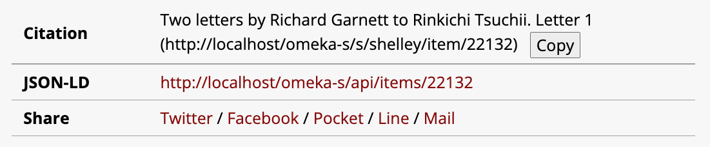

CiteShare (module for Omeka S)
========================

[CiteShare] is a module to add  a citation button and share links.

Image
------------

Installation
------------

See general end user documentation for [installing a module].

* From the zip

Download the last release [CiteShare.zip] from the list of releases, and
uncompress it in the `modules` directory.

* From the source and for development

If the module was installed from the source, rename the name of the folder of
the module to `CiteShare`.

TODO / Bugs
-----------

- [ ] Add a site name to a citation text.

Warning
-------

Use it at your own risk.

It’s always recommended to backup your files and your databases and to check
your archives regularly so you can roll back if needed.

Troubleshooting
---------------

See online issues on the [module issues] page on GitHub.

Contributors
---------

* Satoru Nakamura, 2022- (see [nakamura196] on GitHub)

[CiteShare]: https://github.com/omeka-j/Omeka-S-module-CiteShare
[Omeka S]: https://omeka.org/s
[installing a module]: http://dev.omeka.org/docs/s/user-manual/modules/#installing-modules
[CiteShare.zip]: https://github.com/omeka-j/Omeka-S-module-CiteShare/releases
[module issues]: https://github.com/omeka-j/Omeka-S-module-CiteShare/issues
[nakamura196]: https://github.com/nakamura196 "Satoru Nakamura"
